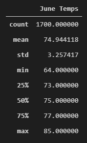
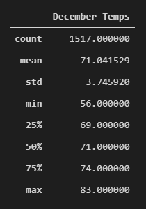

__Surfs Up__

# Overview of the Analysis

- The purpose of the analysis was to collect additional information about temperature trends before W. Avy decides to open the surf shop. Specifically, they wanted temperature data for the months of June and December in Oahu, in order to determine if the surf and ice cream shop business is sustainable year-round.

# Results

- Figure 1

    

- Figure 2

    

- Average temperature

    The difference in the average temperature was approximately 4 degrees. The average temperature in June was 75 degrees compared to 71 degrees in December.

- Range, Min, Max:

    The difference in the range of temperatures by month was 6 degrees, where the range of temperatures in June was 21 degrees and the range in December was 27 degrees.

    The difference in the maximum temperatures was 2 degrees, where the max temperature in June was 85 degrees and the max in December was 83 degrees.

    The difference in the minimum temperatures was 8 degrees, where the minimum temperature in June was 64 degrees and the minimum in December was 56 degrees.

- Differences across quartiles

    

# Additional Queries to Gather More Data

- Compare and contrast the precipation data between June and December across all years in the data set.

- Compare and contrast the precipitation data across the remaining 10 months.

- Compare and contrast the temperature data across the remaining 10 months.